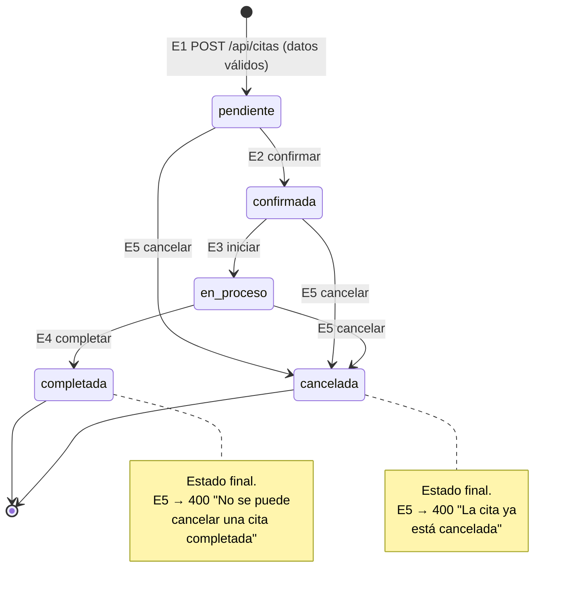

# Parte 1 — Pruebas de Caja Negra

**Proyecto:** RepairTech — Backend de agendamiento de servicio técnico de electrodomésticos
**Tecnología:** Node.js + Express + PostgreSQL
**Herramienta de pruebas:** Jest 30 (cobertura con Istanbul)
**Fecha:** 2026-09-09

---

## 1.0 Variables de entrada seleccionadas

Se seleccionaron **dos variables de entrada** con sus respectivas expresiones/sentencias de validación tomadas directamente del código del proyecto.

| # | Variable | Endpoint | Archivo y línea | Sentencia / expresión de validación |
|---|----------|----------|-----------------|--------------------------------------|
| **V1** | `password` | `POST /api/usuarios/login`<br>`POST /api/usuarios/registro` | [validateLogin.js:8](../../src/middleware/validateLogin.js#L8)<br>[validateLogin.js:23](../../src/middleware/validateLogin.js#L23) | `if (!email \|\| !password) → 400`<br>`if (password.length < 6) → 400` |
| **V2** | `telefono` | `PUT /api/usuarios/:id` | [validateUpdateUsuario.js:20-24](../../src/middleware/validateUpdateUsuario.js#L20-L24) | `if (telefono && telefono.trim() !== '')`<br>`if (!/^\d{7,15}$/.test(telefono.replace(/\s/g,''))) → 400` |

Variables de apoyo usadas en las mismas técnicas:

| Variable | Endpoint | Archivo | Expresión |
|----------|----------|---------|-----------|
| `email` | login / registro | [validateLogin.js:15-16](../../src/middleware/validateLogin.js#L15-L16) | `/^[^\s@]+@[^\s@]+\.[^\s@]+$/` |
| `fecha` | `POST /api/citas` | [validateCrearCita.js:28-38](../../src/middleware/validateCrearCita.js#L28-L38) | `isNaN(new Date(fecha).getTime())` y `fechaDate < hoy` |
| `id` (ruta) | varios | [validateId.js:18](../../src/middleware/validateId.js#L18) | `isNaN(numId) \|\| numId <= 0 \|\| !Number.isInteger(numId)` |
| `estado` | `PUT /api/citas/:id/estado` | [validateCitaEstado.js:8](../../src/middleware/validateCitaEstado.js#L8) | `estadosValidos.includes(estado)` |

---

## 1.1 Partición de Equivalencia

### Clases de equivalencia — V1: `password`

| Clase | Descripción | Tipo | Representante | Salida esperada |
|-------|-------------|------|---------------|-----------------|
| **CE1** | `password` ausente, `null` o cadena vacía | Inválida | `""` | `400` "Email y contraseña son obligatorios" |
| **CE2** | Cadena de 1 a 5 caracteres | Inválida | `"12345"` | `400` "La contraseña debe tener al menos 6 caracteres" |
| **CE3** | Cadena de 6 o más caracteres | **Válida** | `"Clave123"` | Continúa al controlador (`next()`) |
| **CE9** | Tipo de dato distinto de texto (número, booleano, objeto) | Inválida | `12345` | `400` (esperado) — **ver defecto D-04** |

### Clases de equivalencia — V2: `telefono`

| Clase | Descripción | Tipo | Representante | Salida esperada |
|-------|-------------|------|---------------|-----------------|
| **CE4** | Ausente o vacío (el campo es opcional) | **Válida** | `""` | Continúa al controlador |
| **CE5** | De 1 a 6 dígitos | Inválida | `"123456"` | `400` "El teléfono debe contener solo números (7-15 dígitos)" |
| **CE6** | De 7 a 15 dígitos (se admiten espacios internos) | **Válida** | `"3001234567"` | Continúa al controlador |
| **CE7** | 16 dígitos o más | Inválida | `"3001234567890123"` | `400` mismo mensaje |
| **CE8** | Contiene caracteres no numéricos (letras, guiones, `+`) | Inválida | `"300-ABC-4567"` | `400` mismo mensaje |
| **CE9** | Tipo de dato distinto de texto | Inválida | `3001234567` | `400` (esperado) — **ver defecto D-05** |

### Casos de prueba — Partición de equivalencia

| ID | Clase | Variable | Entrada | Resultado esperado | Resultado obtenido | Estado |
|----|-------|----------|---------|--------------------|--------------------|--------|
| CP-EQ01 | CE1 | `password` | `{email:"cliente@repairtech.com", password:""}` | 400 · "…son obligatorios" | 400 · "Email y contraseña son obligatorios" | ✅ Pasa |
| CP-EQ02 | CE2 | `password` | `password:"12345"` | 400 · "…al menos 6 caracteres" | Igual al esperado | ✅ Pasa |
| CP-EQ03 | CE3 | `password` | `password:"Clave123"` | `next()`, sin respuesta de error | Igual al esperado | ✅ Pasa |
| CP-EQ04 | CE4 | `telefono` | `{nombre_completo:"Victor Florez", email:"…", telefono:""}` | `next()` (campo opcional) | Igual al esperado | ✅ Pasa |
| CP-EQ05 | CE5 | `telefono` | `telefono:"123456"` (6 dígitos) | 400 · "7-15 dígitos" | Igual al esperado | ✅ Pasa |
| CP-EQ06 | CE6 | `telefono` | `telefono:"3001234567"` | `next()` | Igual al esperado | ✅ Pasa |
| CP-EQ07 | CE7 | `telefono` | `telefono:"3001234567890123"` (16) | 400 · "7-15 dígitos" | Igual al esperado | ✅ Pasa |
| CP-EQ08 | CE8 | `telefono` | `telefono:"300-ABC-4567"` | 400 · "7-15 dígitos" | Igual al esperado | ✅ Pasa |
| CP-EQ09 | CE6 | `telefono` | `telefono:"300 123 4567"` | `next()` (los espacios se normalizan) | Igual al esperado | ✅ Pasa |
| CP-EQ10 | CE9 | `password` | `password:12345` (número) | 400 · "…al menos 6 caracteres" | **`next()`: la petición pasa sin validar** | ❌ **Defecto D-04** |
| CP-EQ11 | CE9 | `telefono` | `telefono:3001234567` (número) | 400 · "7-15 dígitos" | **`TypeError: telefono.trim is not a function` → HTTP 500** | ❌ **Defecto D-05** |

> Código ejecutable: [tests/middlewares.cajanegra.test.js](../../tests/middlewares.cajanegra.test.js) · sección `1. PARTICION DE EQUIVALENCIA`

---

## 1.2 Análisis de Valores Límite

### V1: `password.length` — frontera en 6

Expresión bajo prueba: `if (password.length < 6)`

| ID | Tipo de valor | Longitud | Entrada | Resultado esperado | Obtenido | Estado |
|----|---------------|----------|---------|--------------------|----------|--------|
| CP-VL01 | Límite inferior externo | 0 | `""` | 400 (campo obligatorio) | 400 | ✅ |
| CP-VL02 | Límite − 1 | 5 | `"aaaaa"` | 400 (mínimo 6) | 400 | ✅ |
| CP-VL03 | **Límite (frontera)** | 6 | `"aaaaaa"` | `next()` — válido | `next()` | ✅ |
| CP-VL04 | Límite + 1 | 7 | `"aaaaaaa"` | `next()` — válido | `next()` | ✅ |

> **Observación O-01:** la variable no tiene límite superior. `bcrypt` sólo considera los primeros **72 bytes** de la contraseña, por lo que dos contraseñas que coincidan en sus primeros 72 bytes se consideran iguales al iniciar sesión. Se recomienda validar `password.length <= 64`.

### V2: cantidad de dígitos de `telefono` — rango 7 a 15

Expresión bajo prueba: `/^\d{7,15}$/`

| ID | Tipo de valor | Dígitos | Entrada | Resultado esperado | Obtenido | Estado |
|----|---------------|---------|---------|--------------------|----------|--------|
| CP-VL05 | Inferior − 1 | 6 | `"333333"` | 400 | 400 | ✅ |
| CP-VL06 | **Límite inferior** | 7 | `"3333333"` | `next()` | `next()` | ✅ |
| CP-VL07 | Inferior + 1 | 8 | `"33333333"` | `next()` | `next()` | ✅ |
| CP-VL08 | Superior − 1 | 14 | `"33333333333333"` | `next()` | `next()` | ✅ |
| CP-VL09 | **Límite superior** | 15 | `"333333333333333"` | `next()` | `next()` | ✅ |
| CP-VL10 | Superior + 1 | 16 | `"3333333333333333"` | 400 | 400 | ✅ |

### Variable de apoyo: `id` de ruta — entero positivo

Expresión: `isNaN(numId) || numId <= 0 || !Number.isInteger(numId)`

| ID | Tipo de valor | Entrada | Resultado esperado | Obtenido | Estado |
|----|---------------|---------|--------------------|----------|--------|
| CP-VL11 | Límite inferior externo | `"0"` | 400 "debe ser un número entero positivo" | 400 | ✅ |
| CP-VL12 | **Límite inferior** | `"1"` | `next()` | `next()` | ✅ |
| CP-VL13 | Fuera de rango | `"-1"` | 400 | 400 | ✅ |
| CP-VL14 | No entero | `"1.5"` | 400 | 400 | ✅ |
| CP-VL15 | No numérico | `"abc"` | 400 | 400 | ✅ |

### Variable de apoyo: `fecha` de la cita — frontera "hoy"

Expresión: `fechaDate < hoy` con `hoy.setHours(0,0,0,0)`

| ID | Tipo de valor | Entrada | Resultado esperado | Obtenido | Estado |
|----|---------------|---------|--------------------|----------|--------|
| CP-CC06 | Límite − 1 día | `"2026-09-08"` (ayer) | 400 "La fecha no puede ser en el pasado" | 400 | ✅ |
| CP-CC08 | **Límite (hoy)** | `"2026-09-09"` (hoy) | `next()` — hoy debe ser agendable | **400 "La fecha no puede ser en el pasado"** | ❌ **Defecto D-01** |
| CP-CC09 | Límite (hoy, con hora local) | `"2026-09-09T00:00:00"` | `next()` | `next()` | ✅ (confirma la causa) |
| CP-CC07 | Límite + 1 día | `"2026-09-10"` (mañana) | `next()` | `next()` | ✅ |

> Código ejecutable: [tests/middlewares.cajanegra.test.js](../../tests/middlewares.cajanegra.test.js) · sección `2. ANALISIS DE VALORES LIMITE` y [tests/validaciones.complementarias.test.js](../../tests/validaciones.complementarias.test.js) · sección `6. CREAR CITA`

---

## 1.3 Diagrama de Transición de Estados

### Estados de una cita

Definidos en [validateCitaEstado.js:7](../../src/middleware/validateCitaEstado.js#L7):
`pendiente`, `confirmada`, `en_proceso`, `completada`, `cancelada`.

### Eventos (API)

| Evento | Endpoint | Efecto |
|--------|----------|--------|
| **E1** Crear cita | `POST /api/citas` | Crea la cita en estado `pendiente` |
| **E2** Confirmar | `PUT /api/citas/:id/estado` `{estado:"confirmada"}` | `pendiente → confirmada` |
| **E3** Iniciar | `PUT /api/citas/:id/estado` `{estado:"en_proceso"}` | `confirmada → en_proceso` |
| **E4** Completar | `PUT /api/citas/:id/estado` `{estado:"completada"}` | `en_proceso → completada` |
| **E5** Cancelar | `PUT /api/citas/:id/cancelar` | `pendiente\|confirmada\|en_proceso → cancelada` |

### Diagrama



### Matriz de transición (comportamiento esperado)

| Estado actual \ Evento | E2 confirmar | E3 iniciar | E4 completar | E5 cancelar |
|------------------------|--------------|------------|--------------|-------------|
| **pendiente** | ✔ confirmada | ✘ inválida | ✘ inválida | ✔ cancelada |
| **confirmada** | ✘ inválida | ✔ en_proceso | ✘ inválida | ✔ cancelada |
| **en_proceso** | ✘ inválida | ✘ inválida | ✔ completada | ✔ cancelada |
| **completada** | ✘ inválida | ✘ inválida | ✘ inválida | ✘ 400 |
| **cancelada** | ✘ inválida | ✘ inválida | ✘ inválida | ✘ 400 |

### Casos de prueba — transiciones válidas y de cancelación

Ejecutados a nivel de controlador sustituyendo PostgreSQL por un doble de prueba (`jest.mock('../src/db')`), en [tests/citas.transiciones.test.js](../../tests/citas.transiciones.test.js).

| ID | Estado inicial | Evento | Resultado esperado | Obtenido | Estado |
|----|----------------|--------|--------------------|----------|--------|
| CP-ET01 | — (no existe) | E1 con datos válidos | 201 · cita en `pendiente` | 201 · `estado: "pendiente"`; el `INSERT` fija el estado inicial de forma literal | ✅ |
| CP-ET01b | — (no existe) | E1 sin técnicos disponibles | 400 · no se crea la cita | 400 "No hay técnicos disponibles…"; una sola consulta, sin `INSERT` | ✅ |
| CP-ET02 | pendiente | E2 | 200 · `confirmada` | Igual al esperado | ✅ |
| CP-ET03 | confirmada | E3 | 200 · `en_proceso` | Igual al esperado | ✅ |
| CP-ET04 | en_proceso | E4 | 200 · `completada` | Igual al esperado | ✅ |
| CP-ET05 | pendiente | E5 | 200 · `cancelada` | Igual al esperado; el `UPDATE` recibe `['cancelada', '51']` | ✅ |
| CP-ET06 | confirmada | E5 | 200 · `cancelada` | Igual al esperado | ✅ |
| CP-ET06b | en_proceso | E5 | 200 · `cancelada` | Igual al esperado | ✅ |
| CP-ET07 | completada | E5 | 400 "No se puede cancelar una cita completada" | Igual al esperado; el `UPDATE` **no** se ejecuta | ✅ |
| CP-ET08 | cancelada | E5 | 400 "La cita ya está cancelada" | Igual al esperado; el `UPDATE` **no** se ejecuta | ✅ |
| CP-ET08b | — (no existe) | E5 | 404 "Cita no encontrado" | Igual al esperado | ✅ |

### Casos de prueba — transiciones inválidas (ejecutados a nivel unitario)

| ID | Entrada (`estado` destino) | Resultado esperado | Obtenido | Estado |
|----|---------------------------|--------------------|----------|--------|
| CP-TE-OK | cada uno de los 5 estados válidos | `next()` | `next()` | ✅ |
| CP-TE01 | `{}` (sin `estado`) | 400 "El estado es obligatorio" | Igual | ✅ |
| CP-TE02 | `"finalizada"` (inexistente) | 400 "Estado no válido" | Igual | ✅ |
| CP-TE03 | `"Pendiente"` (mayúscula inicial) | 400 "Estado no válido" | Igual (comparación sensible a mayúsculas) | ✅ **O-02** |
| CP-ET09 | `completada → pendiente` | 400 transición no permitida | **200: el cambio se aplica** | ❌ **Defecto D-02** |
| CP-ET10 | `cancelada → en_proceso` | 400 transición no permitida | **200: el cambio se aplica** | ❌ **Defecto D-02** |
| CP-ET11 | `pendiente → completada` (salta E2 y E3) | 400 transición no permitida | **200: el cambio se aplica** | ❌ **Defecto D-02** |
| CP-ET12 | evidencia de D-02: se cuenta y se inspecciona el SQL emitido | consultar el estado actual antes de actualizar | **1 sola consulta, un `UPDATE` directo sin `SELECT` previo** | ❌ **Defecto D-02** |
| CP-ET13 | cambio de estado sobre cita inexistente | 404 "Cita no encontrado" | Igual al esperado | ✅ |

> **Base del hallazgo D-02:** `updateCitaEstado` en [citaController.js:211-232](../../src/controllers/citaController.js#L211-L232) ejecuta el `UPDATE` **sin leer el estado actual en ningún momento** (comprobado por `CP-ET12`, que cuenta las llamadas a `pool.query` e inspecciona el SQL emitido). La variante de [userController.js:211-237](../../src/controllers/userController.js#L211-L237) sí consulta la cita, pero sólo para comprobar que existe. El middleware `validateCitaEstado` valida **el valor** del estado, no **la transición**: la máquina de estados de la Figura 1 no está implementada.

> Código ejecutable: [tests/middlewares.cajanegra.test.js](../../tests/middlewares.cajanegra.test.js) · sección `4. DIAGRAMA DE TRANSICION DE ESTADOS`

---

## 1.4 Tablas de Decisión

### Tabla 1 — `POST /api/usuarios/login` (variables `email` y `password`)

**Condiciones**

| Id | Condición | Expresión en código |
|----|-----------|---------------------|
| C1 | `email` presente | `!email` (negada) |
| C2 | `password` presente | `!password` (negada) |
| C3 | `email` cumple el formato | `emailRegex.test(email)` |
| C4 | `password` tiene 6 caracteres o más | `password.length < 6` (negada) |

**Acciones**

| Id | Acción |
|----|--------|
| A1 | `400` "Email y contraseña son obligatorios" |
| A2 | `400` "Formato de email no válido" |
| A3 | `400` "La contraseña debe tener al menos 6 caracteres" |
| A4 | `next()` — continúa al controlador de login |

**Tabla de decisión reducida** (las 2⁴ = 16 combinaciones colapsan en 5 reglas porque el middleware retorna en la primera condición que falla; `–` = indiferente)

| | **R1** | **R2** | **R3** | **R4** | **R5** |
|---|---|---|---|---|---|
| **C1** email presente | F | V | V | V | V |
| **C2** password presente | – | F | V | V | V |
| **C3** email con formato válido | – | – | F | V | V |
| **C4** password ≥ 6 | – | – | – | F | V |
| **A1** 400 obligatorios | **X** | **X** | | | |
| **A2** 400 formato email | | | **X** | | |
| **A3** 400 longitud password | | | | **X** | |
| **A4** next() | | | | | **X** |

**Casos de prueba**

| ID | Regla | Entrada | Resultado esperado | Obtenido | Estado |
|----|-------|---------|--------------------|----------|--------|
| CP-TD01 | R1 | `{email:"", password:"Clave123"}` | 400 · A1 | 400 · A1 | ✅ |
| CP-TD02 | R2 | `{email:"cliente@repairtech.com", password:""}` | 400 · A1 | 400 · A1 | ✅ |
| CP-TD03 | R3 | `{email:"cliente.repairtech.com", password:"Clave123"}` | 400 · A2 | 400 · A2 | ✅ |
| CP-TD04 | R4 | `{email:"cliente@repairtech.com", password:"12345"}` | 400 · A3 | 400 · A3 | ✅ |
| CP-TD05 | R5 | `{email:"cliente@repairtech.com", password:"Clave123"}` | A4 · `next()` | A4 · `next()` | ✅ |

### Tabla 2 — `PUT /api/usuarios/:id` (variable `telefono`)

**Condiciones**

| Id | Condición |
|----|-----------|
| C1 | `nombre_completo` presente y no vacío |
| C2 | `email` presente y no vacío |
| C3 | `email` cumple el formato |
| C4 | `telefono` omitido o vacío (campo opcional) |
| C5 | `telefono` cumple `/^\d{7,15}$/` tras quitar espacios |

**Acciones**

| Id | Acción |
|----|--------|
| A1 | `400` "El nombre completo es obligatorio" |
| A2 | `400` "El correo electrónico es obligatorio" |
| A3 | `400` "El formato del correo electrónico no es válido" |
| A4 | `400` "El teléfono debe contener solo números (7-15 dígitos)" |
| A5 | `next()` — continúa a la actualización |

**Tabla de decisión reducida**

| | **R1** | **R2** | **R3** | **R4** | **R5** | **R6** |
|---|---|---|---|---|---|---|
| **C1** nombre presente | F | V | V | V | V | V |
| **C2** email presente | – | F | V | V | V | V |
| **C3** email válido | – | – | F | V | V | V |
| **C4** teléfono vacío | – | – | – | V | F | F |
| **C5** teléfono con formato válido | – | – | – | – | F | V |
| **A1** | **X** | | | | | |
| **A2** | | **X** | | | | |
| **A3** | | | **X** | | | |
| **A4** | | | | | **X** | |
| **A5** next() | | | | **X** | | **X** |

**Casos de prueba**

| ID | Regla | Entrada (`nombre_completo`, `email`, `telefono`) | Esperado | Obtenido | Estado |
|----|-------|-----------------------------------------------|----------|----------|--------|
| CP-UP01 | R1 | `"  "`, `"a@b.com"`, — | 400 · A1 | 400 · A1 | ✅ |
| CP-UP02 | R2 | `"Victor Florez"`, ausente, — | 400 · A2 | 400 · A2 | ✅ |
| CP-UP03 | R3 | `"Victor Florez"`, `"victor@correo"`, — | 400 · A3 | 400 · A3 | ✅ |
| CP-EQ04 | R4 | `"Victor Florez"`, `"…@repairtech.com"`, `""` | A5 · `next()` | A5 · `next()` | ✅ |
| CP-EQ05 | R5 | `"Victor Florez"`, `"…@repairtech.com"`, `"123456"` | 400 · A4 | 400 · A4 | ✅ |
| CP-EQ06 | R6 | `"Victor Florez"`, `"…@repairtech.com"`, `"3001234567"` | A5 · `next()` | A5 · `next()` | ✅ |

> Código ejecutable: [tests/middlewares.cajanegra.test.js](../../tests/middlewares.cajanegra.test.js) · sección `3. TABLA DE DECISION`

---

## 1.5 Defectos y observaciones encontrados

| Id | Severidad | Técnica que lo detectó | Descripción | Recomendación |
|----|-----------|------------------------|-------------|---------------|
| **D-01** | Alta | Valores límite (`fecha`) | `new Date("2026-09-09")` se interpreta como **UTC** mientras que `hoy` se calcula en hora local. En zonas con desfase negativo (`America/Bogota` = UTC−5) la fecha de **hoy** queda 5 horas antes de la medianoche local y el sistema la rechaza como pasada: no se puede agendar una cita para el mismo día. | Comparar sólo la parte de fecha: `new Date(fecha + 'T00:00:00')` o comparar cadenas `YYYY-MM-DD`. |
| **D-02** | Alta | Transición de estados | `PUT /api/citas/:id/estado` acepta cualquier estado válido sin verificar el estado actual: permite `completada → pendiente`, `cancelada → en_proceso` o saltarse pasos del flujo. | Agregar una tabla de transiciones permitidas y validarla antes del `UPDATE`. |
| **D-04** | Media | Partición de equivalencia (`password`) | Si `password` llega como número, `(12345).length` es `undefined` y `undefined < 6` es `false`: la regla de longitud mínima **no se aplica** y la petición pasa al controlador. | Validar el tipo: `typeof password !== 'string'` → 400. |
| **D-05** | Media | Partición de equivalencia (`telefono`) | Si `telefono` llega como número, `telefono.trim()` lanza `TypeError` y Express responde **500** en lugar de un 400 de validación. Aplica igual a `nombre_completo` y `email`. | Normalizar con `String(valor ?? '')` antes de usar métodos de texto. |
| **O-01** | Baja | Valores límite (`password`) | No existe límite superior de longitud y `bcrypt` sólo usa los primeros 72 bytes. | Validar `password.length <= 64`. |
| **O-02** | Baja | Transición de estados | La comparación de `estado` es sensible a mayúsculas: `"Pendiente"` se rechaza. | Normalizar con `estado.toLowerCase().trim()`. |
| **D-03** | Media | Partición de equivalencia (`email`) | `registrarUsuario` guarda el email tal como llega, pero `loginUsuario` consulta con `email.toLowerCase()` ([userController.js:46](../../src/controllers/userController.js#L46)). Un usuario registrado como `Victor@Repairtech.com` nunca puede iniciar sesión. | Normalizar a minúsculas también en el registro (o usar `LOWER(email)` en la consulta). |
| **O-03** | Baja | Partición de equivalencia (`email`) | La expresión regular es permisiva: acepta dominios como `a@b.c`. Rechaza correctamente `victor@@repairtech.com` y direcciones con espacios. | Suficiente para el alcance actual; endurecer sólo si el negocio lo exige. |

---

## 1.6 Resumen de ejecución (caja negra)

| Técnica | Casos documentados | Casos ejecutados automáticamente | Defectos detectados |
|---------|--------------------|----------------------------------|---------------------|
| Partición de equivalencia | 11 | 11 | D-04, D-05 |
| Análisis de valores límite | 19 | 19 | D-01, O-01 |
| Transición de estados | 20 | 24 (CP-TE-OK se expande a los 5 estados válidos) | D-02, O-02 |
| Tablas de decisión | 11 | 11 | — |

Comando de ejecución:

```bash
npm test
```
