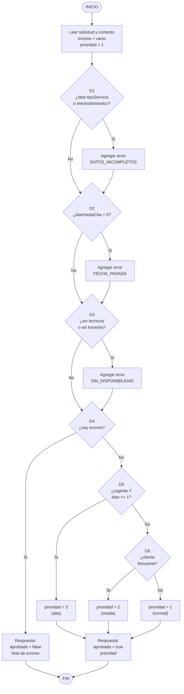
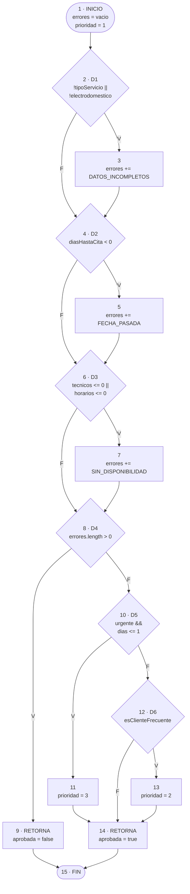
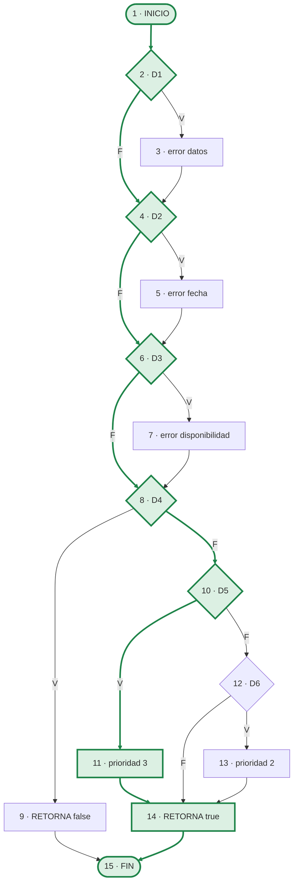
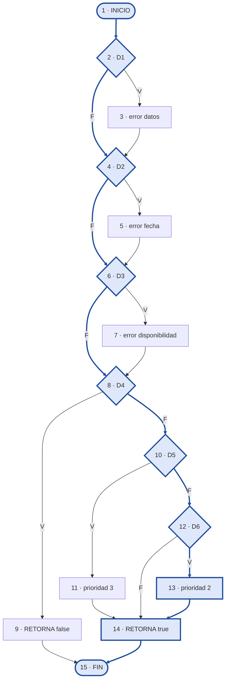
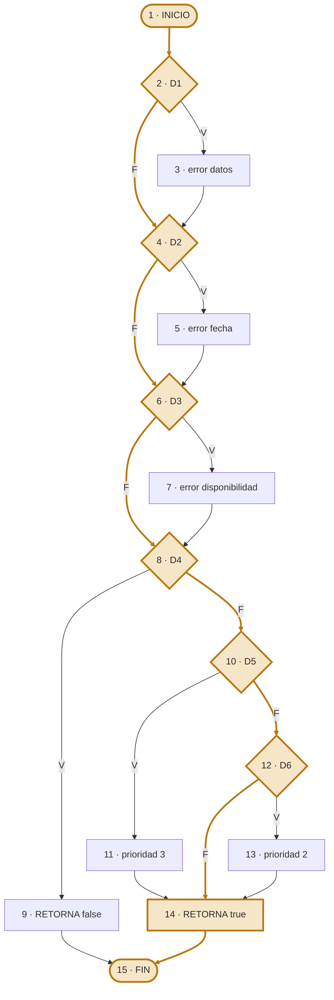
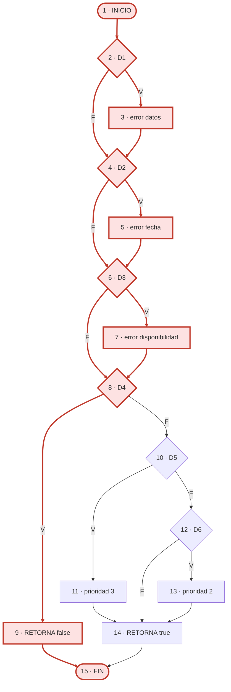
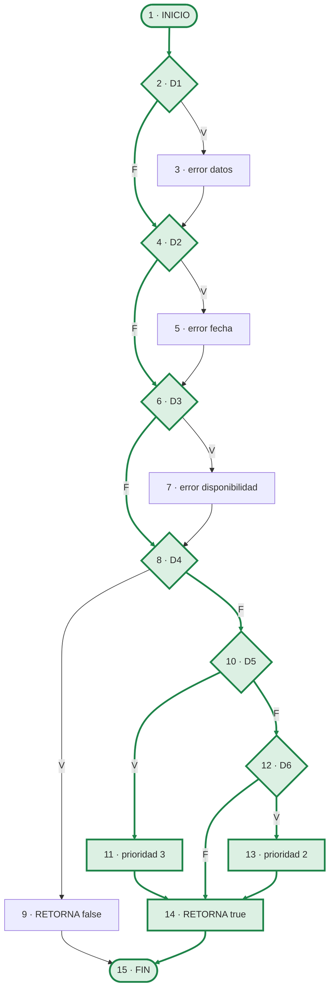

# Parte 2 — Pruebas de Caja Blanca

**Proyecto:** RepairTech — Backend de agendamiento de servicio técnico
**Módulo bajo prueba:** [src/services/citaService.js](../../src/services/citaService.js) → función `evaluarSolicitudCita()`
**Herramienta:** Jest 30 + Istanbul (cobertura)

---

## 2.1 Requisito funcional y algoritmo

> **RF-05 — Evaluación y priorización de una solicitud de cita**
> Cuando un cliente solicita una cita de reparación, el sistema debe validar que la solicitud esté completa, que la fecha no sea pasada y que existan técnicos y horarios disponibles. Si algún requisito falla, la solicitud se rechaza informando **todos** los errores encontrados. Si la solicitud es válida, el sistema le asigna una prioridad de atención: **3 (alta)** cuando el servicio es urgente y la cita es para hoy o mañana, **2 (media)** cuando el solicitante es cliente frecuente, y **1 (normal)** en los demás casos.

Este requisito corresponde al flujo real de `crearCita` ([citaController.js:60-150](../../src/controllers/citaController.js#L60-L150)) y al middleware `validateCrearCita`, extraídos a una función pura para poder medir cobertura sin base de datos.

### Pseudocódigo

```
ALGORITMO EvaluarSolicitudCita(solicitud, contexto)

 1   errores  ← vacío                                                    [N1]
 2   prioridad ← 1
 3   SI (no hay tipoServicio) O (no hay electrodoméstico) ENTONCES       [N2] D1
 4       errores ← errores + 'DATOS_INCOMPLETOS'                         [N3]
 5   FIN SI
 6   SI diasHastaCita < 0 ENTONCES                                       [N4] D2
 7       errores ← errores + 'FECHA_PASADA'                              [N5]
 8   FIN SI
 9   SI (tecnicosDisponibles ≤ 0) O (horariosLibres ≤ 0) ENTONCES        [N6] D3
10       errores ← errores + 'SIN_DISPONIBILIDAD'                        [N7]
11   FIN SI
12   SI cantidad(errores) > 0 ENTONCES                                   [N8] D4
13       RETORNAR {aprobada: falso, prioridad: nulo, errores}            [N9]
14   FIN SI
15   SI (tipoServicio = 'urgente') Y (diasHastaCita ≤ 1) ENTONCES        [N10] D5
16       prioridad ← 3                                                   [N11]
17   SINO SI esClienteFrecuente ENTONCES                                 [N12] D6
18       prioridad ← 2                                                   [N13]
19   FIN SI
20   RETORNAR {aprobada: verdadero, prioridad, errores}                  [N14]
FIN                                                                      [N15]
```

**Sentencias de decisión: 6** (D1, D2, D3, D4, D5, D6) — cumple el mínimo de 4 exigido.

---

## 2.2 Diagrama de flujo



---

## 2.3 Diagrama de Flujo de Control (CFG)



### Nodos (N = 15)

| Nodo | Tipo | Contenido |
|------|------|-----------|
| 1 | Inicio | `errores = []`, `prioridad = 1` |
| 2 | **Decisión D1** | `!tipoServicio \|\| !electrodomestico` |
| 3 | Proceso | `errores.push('DATOS_INCOMPLETOS')` |
| 4 | **Decisión D2** | `diasHastaCita < 0` |
| 5 | Proceso | `errores.push('FECHA_PASADA')` |
| 6 | **Decisión D3** | `tecnicosDisponibles <= 0 \|\| horariosLibres <= 0` |
| 7 | Proceso | `errores.push('SIN_DISPONIBILIDAD')` |
| 8 | **Decisión D4** | `errores.length > 0` |
| 9 | Salida | `return {aprobada:false, prioridad:null, errores}` |
| 10 | **Decisión D5** | `tipoServicio === 'urgente' && diasHastaCita <= 1` |
| 11 | Proceso | `prioridad = 3` |
| 12 | **Decisión D6** | `esClienteFrecuente` |
| 13 | Proceso | `prioridad = 2` |
| 14 | Salida | `return {aprobada:true, prioridad, errores}` |
| 15 | Fin | — |

### Aristas (E = 20)

| # | Arista | Rama | # | Arista | Rama |
|---|--------|------|---|--------|------|
| a1 | 1 → 2 | — | a11 | 8 → 9 | V |
| a2 | 2 → 3 | V | a12 | 8 → 10 | F |
| a3 | 2 → 4 | F | a13 | 9 → 15 | — |
| a4 | 3 → 4 | — | a14 | 10 → 11 | V |
| a5 | 4 → 5 | V | a15 | 10 → 12 | F |
| a6 | 4 → 6 | F | a16 | 11 → 14 | — |
| a7 | 5 → 6 | — | a17 | 12 → 13 | V |
| a8 | 6 → 7 | V | a18 | 12 → 14 | F |
| a9 | 6 → 8 | F | a19 | 13 → 14 | — |
| a10 | 7 → 8 | — | a20 | 14 → 15 | — |

---

## 2.4 Complejidad ciclomática

Se calcula por los tres métodos y los tres coinciden:

| Método | Fórmula | Cálculo | Resultado |
|--------|---------|---------|-----------|
| Aristas y nodos | `V(G) = E − N + 2` | `20 − 15 + 2` | **7** |
| Nodos predicado | `V(G) = P + 1` | `6 + 1` (D1…D6) | **7** |
| Regiones del grafo | `V(G) = R` | 6 regiones internas + 1 externa | **7** |

### Interpretación

| V(G) | Riesgo | Situación del algoritmo |
|------|--------|--------------------------|
| 1 – 10 | **Bajo — código simple, poco riesgo** | ← `evaluarSolicitudCita()` = 7 |
| 11 – 20 | Moderado | |
| 21 – 50 | Alto | |
| > 50 | Muy alto, no testeable | |

`V(G) = 7` significa que existen **7 caminos linealmente independientes** (conjunto base) y que se necesitan **como mínimo 7 casos de prueba** para recorrer ese conjunto base.

---

## 2.5 Cobertura de Sentencia (Statement Coverage)

**Objetivo:** ejecutar cada sentencia (cada nodo del CFG) al menos una vez.
**Casos necesarios: 3.**

| ID | Entrada (`solicitud` / `contexto`) | Camino recorrido (nodos) | Salida esperada | Obtenida | Estado |
|----|------------------------------------|--------------------------|-----------------|----------|--------|
| **CP-S1** | `{tipoServicio:"", electrodomestico:"", diasHastaCita:-1}` / `{tecnicos:0, horarios:0}` | `1-2-3-4-5-6-7-8-9-15` | `aprobada:false` con los 3 errores | Igual | ✅ |
| **CP-S2** | `{tipoServicio:"urgente", electrodomestico:"Nevera", diasHastaCita:1}` / `{tecnicos:2, horarios:4}` | `1-2-4-6-8-10-11-14-15` | `aprobada:true`, `prioridad:3` | Igual | ✅ |
| **CP-S3** | `{tipoServicio:"mantenimiento", electrodomestico:"Lavadora", diasHastaCita:5, esClienteFrecuente:true}` / `{tecnicos:2, horarios:4}` | `1-2-4-6-8-10-12-13-14-15` | `aprobada:true`, `prioridad:2` | Igual | ✅ |

**Verificación:** unión de nodos = {1,2,3,4,5,6,7,8,9} ∪ {10,11,14,15} ∪ {12,13} = **los 15 nodos → 100 % de sentencias**.

### Rutas dibujadas sobre el CFG

**CP-S1** — ruta `1-2-3-4-5-6-7-8-9-15` (todas las validaciones fallan)


**CP-S2** — ruta `1-2-4-6-8-10-11-14-15` (urgente para mañana → prioridad 3)



**CP-S3** — ruta `1-2-4-6-8-10-12-13-14-15` (cliente frecuente → prioridad 2)



---

## 2.6 Cobertura de Decisión (Decision / Branch Coverage)

**Objetivo:** que cada decisión se evalúe al menos una vez a **verdadero** y una vez a **falso** (recorrer las 12 ramas V/F).
**Casos necesarios: 4.**

| ID | Entrada | D1 | D2 | D3 | D4 | D5 | D6 | Camino | Salida | Estado |
|----|---------|----|----|----|----|----|----|--------|--------|--------|
| **CP-D1** | `{"", "", -1}` / `{0, 0}` | V | V | V | V | – | – | `1-2-3-4-5-6-7-8-9-15` | 3 errores | ✅ |
| **CP-D2** | `{"urgente","Nevera",0}` / `{2,4}` | F | F | F | F | V | – | `1-2-4-6-8-10-11-14-15` | prioridad 3 | ✅ |
| **CP-D3** | `{"mantenimiento","Lavadora",5, frecuente:true}` / `{2,4}` | F | F | F | F | F | V | `1-2-4-6-8-10-12-13-14-15` | prioridad 2 | ✅ |
| **CP-D4** | `{"mantenimiento","Lavadora",5, frecuente:false}` / `{2,4}` | F | F | F | F | F | F | `1-2-4-6-8-10-12-14-15` | prioridad 1 | ✅ |

**Verificación de ramas**

| Decisión | Rama V cubierta por | Rama F cubierta por |
|----------|---------------------|---------------------|
| D1 | CP-D1 | CP-D2, CP-D3, CP-D4 |
| D2 | CP-D1 | CP-D2, CP-D3, CP-D4 |
| D3 | CP-D1 | CP-D2, CP-D3, CP-D4 |
| D4 | CP-D1 | CP-D2, CP-D3, CP-D4 |
| D5 | CP-D2 | CP-D3, CP-D4 |
| D6 | CP-D3 | **CP-D4** |

> **Punto clave:** la cobertura de sentencia se logra con **3** casos, pero la de decisión exige **4**. El caso adicional es **CP-D4**, porque la rama falsa de **D6** (`else` implícito) **no contiene ninguna sentencia**: `prioridad` conserva el valor 1 asignado en el nodo 1. Ejecutar todas las líneas no garantiza recorrer todas las ramas.

### Ruta adicional dibujada — CP-D4 `1-2-4-6-8-10-12-14-15`



---

## 2.7 Cobertura de Caminos (Path Coverage)

Las tres primeras decisiones (D1, D2, D3) son **independientes entre sí**, por lo que generan `2³ = 8` combinaciones. En 7 de ellas hay al menos un error y el flujo termina en el nodo 9. La octava combinación (sin errores) continúa hacia la priorización, que aporta 3 caminos más.

> **Total de caminos ejecutables: 7 + 3 = 10.**
> El algoritmo **no tiene bucles**, por eso el número de caminos es finito y se puede cubrir al 100 %.

| ID | D1 | D2 | D3 | D4 | D5 | D6 | Camino (nodos) | Entrada | Salida esperada | Estado |
|----|----|----|----|----|----|----|----------------|---------|-----------------|--------|
| **CP-R1** | V | V | V | V | – | – | `1-2-3-4-5-6-7-8-9-15` | `{"","",-2}` / `{0,0}` | rechazada, 3 errores | ✅ |
| **CP-R2** | V | V | F | V | – | – | `1-2-3-4-5-6-8-9-15` | `{"","",-1}` / `{2,4}` | rechazada, 2 errores | ✅ |
| **CP-R3** | V | F | V | V | – | – | `1-2-3-4-6-7-8-9-15` | `{"","Nevera",3}` / `{0,5}` | rechazada, 2 errores | ✅ |
| **CP-R4** | V | F | F | V | – | – | `1-2-3-4-6-8-9-15` | `{"urgente","",2}` / `{1,1}` | rechazada, 1 error | ✅ |
| **CP-R5** | F | V | V | V | – | – | `1-2-4-5-6-7-8-9-15` | `{"mantenimiento","Lavadora",-5}` / `{0,0}` | rechazada, 2 errores | ✅ |
| **CP-R6** | F | V | F | V | – | – | `1-2-4-5-6-8-9-15` | `{"mantenimiento","Lavadora",-1}` / `{3,6}` | rechazada, 1 error | ✅ |
| **CP-R7** | F | F | V | V | – | – | `1-2-4-6-7-8-9-15` | `{"mantenimiento","Lavadora",4}` / `{2,0}` | rechazada, 1 error | ✅ |
| **CP-R8** | F | F | F | F | V | – | `1-2-4-6-8-10-11-14-15` | `{"urgente","Nevera",0}` / `{1,2}` | aprobada, prioridad 3 | ✅ |
| **CP-R9** | F | F | F | F | F | V | `1-2-4-6-8-10-12-13-14-15` | `{"mantenimiento","Microondas",6, frecuente:true}` / `{1,1}` | aprobada, prioridad 2 | ✅ |
| **CP-R10** | F | F | F | F | F | F | `1-2-4-6-8-10-12-14-15` | `{"instalacion","Secadora",10, frecuente:false}` / `{4,7}` | aprobada, prioridad 1 | ✅ |

### Conjunto base de caminos (McCabe) — 7 caminos

Se parte de un camino base y se invierte una decisión a la vez:

| # | Camino base / decisión invertida | Caso |
|---|----------------------------------|------|
| B1 | Camino base (todas las decisiones en F) | CP-R10 |
| B2 | Invertir **D1** | CP-R4 |
| B3 | Invertir **D2** | CP-R6 |
| B4 | Invertir **D3** | CP-R7 |
| B5 | Invertir **D5** | CP-R8 |
| B6 | Invertir **D6** | CP-R9 |
| B7 | Combinación de dos guardas (independiente de las anteriores) | CP-R2 |

> **Nota:** D4 es una **decisión dependiente**: su valor se deriva de D1, D2 y D3 (`errores.length > 0`), por lo que no puede invertirse de forma aislada; su rama verdadera queda cubierta por B2, B3 y B4. El séptimo camino independiente se toma de las combinaciones de guardas (CP-R2).

**Relación entre las tres coberturas**

| Criterio | Casos | ¿Incluye al anterior? |
|----------|-------|------------------------|
| Sentencia | 3 | — |
| Decisión | 4 | Sí |
| Caminos | 10 | Sí (los 10 recorren todas las ramas y sentencias) |

### Rutas de caminos dibujadas sobre el CFG

**Grupo A — caminos de rechazo (CP-R1 … CP-R7):** recorren la zona de guardas (nodos 2 al 9). Cada combinación V/F de D1-D2-D3 es un camino distinto.



**Grupo B — caminos de aprobación (CP-R8, CP-R9, CP-R10):** las tres salidas de la zona de priorización.



---

## 2.8 Pruebas de Condición y Cobertura

### Condiciones atómicas del algoritmo (9)

| Decisión | Operador | Condiciones atómicas |
|----------|----------|----------------------|
| **D1** | `\|\|` | **C1:** `!tipoServicio` · **C2:** `!electrodomestico` |
| **D2** | simple | **C3:** `diasHastaCita < 0` |
| **D3** | `\|\|` | **C4:** `tecnicosDisponibles <= 0` · **C5:** `horariosLibres <= 0` |
| **D4** | simple | **C6:** `errores.length > 0` |
| **D5** | `&&` | **C7:** `tipoServicio === 'urgente'` · **C8:** `diasHastaCita <= 1` |
| **D6** | simple | **C9:** `esClienteFrecuente` |

> **Evaluación en cortocircuito (JavaScript):** en `A || B`, si `A` es verdadera `B` no se evalúa; en `A && B`, si `A` es falsa `B` no se evalúa. Por eso los casos deben diseñarse para que cada condición llegue realmente a evaluarse.

### a) Cobertura de Condición — cada condición atómica en V y en F (5 casos)

| ID | Entrada | C1 | C2 | C3 | C4 | C5 | C6 | C7 | C8 | C9 |
|----|---------|----|----|----|----|----|----|----|----|----|
| **T1** | `{"", "", -1}` / `{0,0}` | **V** | – | **V** | **V** | – | **V** | – | – | – |
| **T2** | `{"urgente", undefined, 0}` / `{2,0}` | F | **V** | **F** | **F** | **V** | V | – | – | – |
| **T3** | `{"urgente","Nevera",1}` / `{1,1}` | F | **F** | F | F | **F** | **F** | **V** | **V** | – |
| **T4** | `{"mantenimiento","Lavadora",5, frec:false}` / `{2,4}` | F | F | F | F | F | F | **F** | – | **F** |
| **T5** | `{"urgente","Nevera",3, frec:true}` / `{2,4}` | F | F | F | F | F | F | **V** | **F** | **V** |

`–` = la condición no se evalúa por cortocircuito. Cada una de las 9 condiciones aparece al menos una vez en **V** y una vez en **F** → **100 % de cobertura de condición**.

### b) Cobertura de Decisión/Condición

El conjunto T1-T5 también deja cada decisión en V y en F (D1: T1/T3 · D2: T1/T2 · D3: T1/T3 · D4: T1/T3 · D5: T3/T4 · D6: T5/T4), por lo que **satisface simultáneamente la cobertura de condición y la de decisión**.

### c) Cobertura de Condición Múltiple — todas las combinaciones (18 casos)

**D1 — `C1 || C2`**

| ID | C1 | C2 | D1 | Entrada | Resultado esperado | Estado |
|----|----|----|----|---------|--------------------|--------|
| CP-COND1 | V | V | **V** | `tipoServicio:""`, `electrodomestico:""` | error DATOS_INCOMPLETOS | ✅ |
| CP-COND2 | V | F | **V** | `tipoServicio:""`, `electrodomestico:"Nevera"` | error DATOS_INCOMPLETOS (C2 no se evalúa) | ✅ |
| CP-COND3 | F | V | **V** | `tipoServicio:"urgente"`, `electrodomestico:undefined` | error DATOS_INCOMPLETOS | ✅ |
| CP-COND4 | F | F | **F** | datos completos | sin error de datos | ✅ |

**D3 — `C4 || C5`**

| ID | C4 | C5 | D3 | Entrada (`contexto`) | Resultado esperado | Estado |
|----|----|----|----|----------------------|--------------------|--------|
| CP-COND5 | V | V | **V** | `{0, 0}` | error SIN_DISPONIBILIDAD | ✅ |
| CP-COND6 | V | F | **V** | `{0, 5}` | error SIN_DISPONIBILIDAD | ✅ |
| CP-COND7 | F | V | **V** | `{3, 0}` | error SIN_DISPONIBILIDAD | ✅ |
| CP-COND8 | F | F | **F** | `{3, 5}` | sin error de disponibilidad | ✅ |

**D5 — `C7 && C8`**

| ID | C7 | C8 | D5 | Entrada | Resultado esperado | Estado |
|----|----|----|----|---------|--------------------|--------|
| CP-COND9 | V | V | **V** | `"urgente"`, `dias:1` | prioridad 3 | ✅ |
| CP-COND10 | V | F | **F** | `"urgente"`, `dias:2` | prioridad 1 | ✅ |
| CP-COND11 | F | V | **F** | `"mantenimiento"`, `dias:0` | prioridad 1 (C8 no se evalúa) | ✅ |
| CP-COND12 | F | F | **F** | `"instalacion"`, `dias:8` | prioridad 1 | ✅ |

**Condiciones simples D2, D4, D6**

| ID | Condición | Valor | Entrada | Resultado esperado | Estado |
|----|-----------|-------|---------|--------------------|--------|
| CP-COND13 | C3 | V | `dias:-1` | error FECHA_PASADA | ✅ |
| CP-COND14 | C3 | F | `dias:0` | sin error de fecha | ✅ |
| CP-COND15 | C6 | V | `dias:-3` | `aprobada:false` | ✅ |
| CP-COND16 | C6 | F | solicitud válida | continúa a priorización | ✅ |
| CP-COND17 | C9 | V | `frecuente:true` | prioridad 2 | ✅ |
| CP-COND18 | C9 | F | `frecuente:false` | prioridad 1 | ✅ |

### d) MC/DC (cada condición afecta el resultado de forma independiente)

| Decisión | Pares que demuestran independencia | Casos | Mínimo teórico (`n+1`) |
|----------|------------------------------------|-------|------------------------|
| **D1** (`C1\|\|C2`) | C1: CP-COND4 ↔ CP-COND2 · C2: CP-COND4 ↔ CP-COND3 | 3 | 3 |
| **D3** (`C4\|\|C5`) | C4: CP-COND8 ↔ CP-COND6 · C5: CP-COND8 ↔ CP-COND7 | 3 | 3 |
| **D5** (`C7&&C8`) | C7: CP-COND9 ↔ CP-COND11 · C8: CP-COND9 ↔ CP-COND10 | 3 | 3 |
| D2, D4, D6 (simples) | valor V y valor F | 2 c/u | 2 |

Los 18 casos de condición múltiple **contienen** el conjunto MC/DC, por lo que también se cumple este criterio.

---

## 2.9 Código y ejecución de la cobertura

### Archivos

| Archivo | Contenido |
|---------|-----------|
| [src/services/citaService.js](../../src/services/citaService.js) | Algoritmo `evaluarSolicitudCita()` con los nodos del CFG marcados como `[Nx]` |
| [tests/citaService.cajablanca.test.js](../../tests/citaService.cajablanca.test.js) | Casos CP-S, CP-D, CP-R y CP-COND |
| [tests/middlewares.cajanegra.test.js](../../tests/middlewares.cajanegra.test.js) | Casos de caja negra (CP-EQ, CP-VL, CP-TD, CP-TE) |
| [tests/validaciones.complementarias.test.js](../../tests/validaciones.complementarias.test.js) | Casos CP-RG, CP-CC, CP-UP, CP-ID |
| [tests/citas.transiciones.test.js](../../tests/citas.transiciones.test.js) | Casos CP-ET de transición de estados, con `jest.mock` de la base de datos |

### Librería de cobertura

**Jest 30**, que integra **Istanbul** como motor de instrumentación. Configuración en [package.json](../../package.json):

```json
"jest": {
  "testEnvironment": "node",
  "collectCoverageFrom": [
    "src/services/**/*.js",
    "src/middleware/**/*.js",
    "!src/middleware/auth.js"
  ],
  "coverageReporters": ["text", "text-summary", "html", "lcov"],
  "coverageDirectory": "coverage"
}
```

> `auth.js` se excluye porque es un *stub* sin lógica (sólo imprime un log y llama a `next()`).

> **Alcance de la medición.** El porcentaje se calcula sobre el algoritmo de caja blanca y los middlewares de validación, que son el objeto de este trabajo. Los controladores se ejercitan en `citas.transiciones.test.js` pero quedan fuera del alcance medido: sólo se probaron sus rutas de cambio de estado, no las consultas de listado.

### Comandos

```bash
npm install          # instala jest
npm test             # ejecuta los 123 casos
npm run test:coverage   # ejecuta y mide cobertura
```

El informe navegable queda en `coverage/lcov-report/index.html`, donde cada línea aparece coloreada y las ramas no cubiertas se marcan con `I` (rama if) y `E` (rama else).

### Resultado obtenido

```
---------------------------|---------|----------|---------|---------|-------------------
File                       | % Stmts | % Branch | % Funcs | % Lines | Uncovered Line #s
---------------------------|---------|----------|---------|---------|-------------------
All files                  |     100 |      100 |     100 |     100 |
 middleware                |     100 |      100 |     100 |     100 |
  validateCitaEstado.js    |     100 |      100 |     100 |     100 |
  validateCrearCita.js     |     100 |      100 |     100 |     100 |
  validateId.js            |     100 |      100 |     100 |     100 |
  validateLogin.js         |     100 |      100 |     100 |     100 |
  validateRegistro.js      |     100 |      100 |     100 |     100 |
  validateUpdateUsuario.js |     100 |      100 |     100 |     100 |
 services                  |     100 |      100 |     100 |     100 |
  citaService.js           |     100 |      100 |     100 |     100 |
---------------------------|---------|----------|---------|---------|-------------------

=============================== Coverage summary ===============================
Statements   : 100% ( 93/93 )
Branches     : 100% ( 91/91 )
Functions    : 100% ( 8/8 )
Lines        : 100% ( 93/93 )
================================================================================

Test Suites: 4 passed, 4 total
Tests:       123 passed, 123 total
```

| Métrica de Istanbul | Criterio de la materia | Resultado |
|---------------------|------------------------|-----------|
| `% Stmts` / `% Lines` | **Cobertura de sentencia** | **100 %** (93/93) |
| `% Branch` | **Cobertura de decisión** | **100 %** (91/91) |
| `% Funcs` | Cobertura de funciones | **100 %** (8/8) |

---

## 2.10 Matriz de trazabilidad

| Técnica | Casos | Identificadores | Archivo |
|---------|-------|-----------------|---------|
| Partición de equivalencia | 11 | CP-EQ01 … CP-EQ11 | `middlewares.cajanegra.test.js` |
| Valores límite | 19 | CP-VL01 … CP-VL15, CP-CC06 … CP-CC09 | `middlewares.cajanegra.test.js`, `validaciones.complementarias.test.js` |
| Transición de estados | 24 | CP-TE-OK, CP-TE01 … CP-TE03<br/>CP-ET01 … CP-ET13 | `middlewares.cajanegra.test.js`<br/>`citas.transiciones.test.js` |
| Tablas de decisión | 11 | CP-TD01 … CP-TD05, CP-UP01 … CP-UP03, CP-EQ04-06 | `middlewares.cajanegra.test.js` |
| Cobertura de sentencia | 3 | CP-S1 … CP-S3 | `citaService.cajablanca.test.js` |
| Cobertura de decisión | 4 | CP-D1 … CP-D4 | `citaService.cajablanca.test.js` |
| Cobertura de caminos | 10 | CP-R1 … CP-R10 | `citaService.cajablanca.test.js` |
| Condición y condición múltiple | 18 | CP-COND1 … CP-COND18 | `citaService.cajablanca.test.js` |
| Robustez | 2 | CP-ROB1, CP-ROB2 | `citaService.cajablanca.test.js` |
| Validación de registro y cita | 26 | CP-RG01 … CP-RG14, CP-CC01 … CP-CC12 | `validaciones.complementarias.test.js` |
